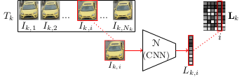
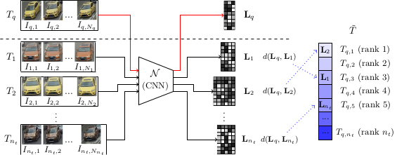

# Vehicle Re-Identification using Track-to-track ranking of deep latent representation of vehicles

This repository is related to the publication "Improving Vehicle Re-Identification using CNN Latent Spaces: Metrics Comparison and Track-to-track Extension" (https://arxiv.org/abs/1910.09458). This paper is a postprint of the paper submitted and accepted to IET Computer Vision (https://digital-library.theiet.org/content/journals/iet-cvi).

## Vehicle Re-Identification using CNN latent representation

### Latent representation extraction

We defined track of vehicle  as a set of  images of a vehicle recorded by a given camera. 


For a given image , we extract its latent representation (LR)  by projecting it in the latent space of a neural network  (in our experiments, the second-to-last layer of a CNN).

We construct the matrix , the LR of the track $T_k$ as a concatenation of the LR of the  images of the track.



### I2T/T2T Ranking procedure

Given a distance metric , a query track , and a set of test tracks 

The track-to-track ranking (T2T) process consists in ranking every track of  to construct an ordered set , such that a track  is the  nearest track from the query according to the distance function ,  being the first match (i.e. the nearest) and , being the last (i.e. the farthest).



The image-to-track ranking (I2T) corresponds to the T2T ranking procedure but with a query track composed of only one image , and its corresponding LR  (only the distance metric d used differs). 

### Distance metric (I2T)

In I2T ranking process the distance  is computed between a query composed of one image , and a test track .


    - MED : Minimal Euclidean Distance

 

    - MCD : Minimal Cosine Distance

 

    - RSCR : Residual of the Sparse Coding Reconstruction
  


with 


### Aggregation function for T2TP

In track-to-track (T2T) ranking process the distance  is computed between a query track  and a test track . 

- If the distance metric is based on MED or MCD, an aggregation function  is used to aggregate the set of I2T distances () between each  of the query and the test track  : 


    - min : minimum of distances
    - mean : average of distances
    - med : median of distances
    - mean50 : average of distances between the 50% smallest distances
    - med50 : average of distances between 50% smallest distances

- If the distance is based on RSCR, the distance between  and  is computed as follows : 


with 


Note :  denotes the Frobenius norm

## The package ```vehicle_reid```

The python package ```vehicle_reid``` contains code for :
1. Extract the latent representation of images of vehicle using the second-to-last layer of our CNN fine-tuned in the task of vehicle recognition as proposed in our paper. The CNN considered here is based on the DenseNet201 (https://arxiv.org/abs/1608.06993) architectures which has been fine-tuned using the VeRI dataset (https://github.com/VehicleReId/VeRidataset). Corresponding weights are given in ```"data/cnn_weights/VeRI_densenet_ft50.pth"```
2. Compute the Ranking Vehicle Re-identification between tracks of vehicle using the various distance metrics studied in the paper. 
3. Compute the performance metrics rank1 rank5 and mAP.


The module ```vehicle_reid``` is composed of 3 modules 
- ```latent_representation.py```
    - Extract latent representation (LR) of each track of vehicle -> return a json file containing the LR for each track
- ```ranking.py```
    - Compute the ranking for each query track -> return a json file containing the ranking for each query track
- ```performance.py```
    - Compute the performance metrics. namely rank1 rank5 and mAP (See paper for details)

### Dependencies
- numpy==1.19.2
- torchvision==0.7.0
- torch==1.6.0
- scikit_learn==0.23.2

### Running example 
The directory ```data``` contains data to test the module ```vehicle_reid```. Note that to perform the VeRI experiments presented on the paper, you'll need the VeRI dataset which can be found, by simple request to authors, here : https://github.com/JDAI-CV/VeRidataset

- data/cnn_weights/VeRI_densenet_ft50.pth : Pre-trained weights for the DenseNet201 architecture. The model has been trained to classify vehicles of training set the VeRI dataset. Only its latent space (the second-to-last layer) is used to extract features
- data/image_sample : some VeRI tracks of vehicle (splitted in query and test). 

``` 
python3 run_example.py
```


